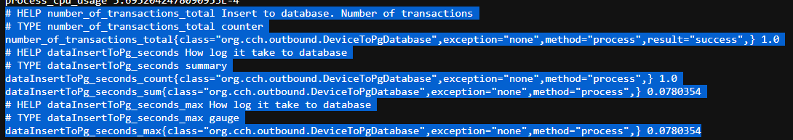

WSL access windows service setting `QUARKUS_HTTP_HOST=0.0.0.0`.
# app-health Project

This project uses Quarkus, the Supersonic Subatomic Java Framework.

If you want to learn more about Quarkus, please visit its website: https://quarkus.io/ .

## Running the application in dev mode

You can run your application in dev mode that enables live coding using:
```shell script
./gradlew quarkusDev
```

> **_NOTE:_**  Quarkus now ships with a Dev UI, which is available in dev mode only at http://localhost:8080/q/dev/.

## Packaging and running the application

The application can be packaged using:
```shell script
./gradlew build
```
It produces the `quarkus-run.jar` file in the `build/quarkus-app/` directory.
Be aware that it’s not an _über-jar_ as the dependencies are copied into the `build/quarkus-app/lib/` directory.

The application is now runnable using `java -jar build/quarkus-app/quarkus-run.jar`.

If you want to build an _über-jar_, execute the following command:
```shell script
./gradlew build -Dquarkus.package.type=uber-jar
```

The application, packaged as an _über-jar_, is now runnable using `java -jar build/*-runner.jar`.

## Creating a native executable

You can create a native executable using: 
```shell script
./gradlew build -Dquarkus.package.type=native
```

Or, if you don't have GraalVM installed, you can run the native executable build in a container using: 
```shell script
./gradlew build -Dquarkus.package.type=native -Dquarkus.native.container-build=true
```

You can then execute your native executable with: `./build/app-health-1.0.0-SNAPSHOT-runner`

If you want to learn more about building native executables, please consult https://quarkus.io/guides/gradle-tooling.

## Related Guides

- Camel Log ([guide](https://camel.apache.org/camel-quarkus/latest/reference/extensions/log.html)): Log messages to the underlying logging mechanism
- Camel Core ([guide](https://camel.apache.org/camel-quarkus/latest/reference/extensions/core.html)): Camel core functionality and basic Camel languages: Constant, ExchangeProperty, Header, Ref, Simple and Tokenize
- RESTEasy Reactive ([guide](https://quarkus.io/guides/resteasy-reactive)): A JAX-RS implementation utilizing build time processing and Vert.x. This extension is not compatible with the quarkus-resteasy extension, or any of the extensions that depend on it.
- SmallRye OpenAPI ([guide](https://quarkus.io/guides/openapi-swaggerui)): Document your REST APIs with OpenAPI - comes with Swagger UI
- Camel Paho MQTT5 ([guide](https://camel.apache.org/camel-quarkus/latest/reference/extensions/paho-mqtt5.html)): Communicate with MQTT message brokers using Eclipse Paho MQTT v5 Client
- Camel Jackson ([guide](https://camel.apache.org/camel-quarkus/latest/reference/extensions/jackson.html)): Marshal POJOs to JSON and back using Jackson
- Hibernate ORM with Panache ([guide](https://quarkus.io/guides/hibernate-orm-panache)): Simplify your persistence code for Hibernate ORM via the active record or the repository pattern
- Camel Bean ([guide](https://camel.apache.org/camel-quarkus/latest/reference/extensions/bean.html)): Invoke methods of Java beans
- JDBC Driver - PostgreSQL ([guide](https://quarkus.io/guides/datasource)): Connect to the PostgreSQL database via JDBC

## Provided Code

### RESTEasy Reactive

Easily start your Reactive RESTful Web Services

[Related guide section...](https://quarkus.io/guides/getting-started-reactive#reactive-jax-rs-resources)


## Application health
現今的微服務和 Kubernetes 盛行，從原本的單體服務切分了數個服務，同時應用程式失敗機率會相對提高，因此應用程式的健康是首要問題，如果不是則應用程式失敗將會是一個挑戰。

只要新增 `quarkus-smallrye-healty` 默認會註冊 `liveness`、`readiness` 探針，當服務啟動時都會返回 `UP`。

```shell
http://localhost:8080/q/health/live
{
    "status": "UP",
    "checks": [
    ]
}

http://localhost:8080/q/health/ready
{
    "status": "UP",
    "checks": [
        {
            "name": "Database connections health check",
            "status": "UP",
            "data": {
                "<default>": "UP"
            }
        }
    ]
}
```

## Health 規範

MicroProfile Health 規範透過以下定義來支援這種健康檢測的契約：
- Health endpoints
    - `/health/live` 和 `/health/ready` 端點的訪問
    - Quarkus 將它們分別重定向到 `/q/health/live` 和 `/q/health/ready` 端點
- HTTP status code
    - 反映健康狀態
- HTTP response payload
    - JSON 回應訊息提供狀態以及其它元數據和上下文
- Application liveness
    - 定義應用程式是否啟動並正常運行
- Application readiness
    - 定義應用程式是否可接收外部請求流量
- Application health API
    - 根據自定義方式公開應用程序 `liveness` 和 `readiness`

    
*liveness*

底層平台向 `/q/health/live` 端點發出 HTTP 請求，以確定是否應該重新啟動應用程式。
如果服務是啟動的，則返回 `200` 的結果 UP；如果無法上線，返回 `503` 的結果 DOWN；無法被計算健康檢查，返回 `500`。
此探針，預設端點在 */q/health/live*

*readiness*

底層平台向 `/q/health/ready` 端點發出 HTTP 請求，以確定應用程式是否準備好接受流量。
如果服務已經**準備好處理請求**，返回 `200` UP。相較於 `liveness` 不同，因為他表示**服務已經啟動**，但可能還不能處理任何請求(資料庫在做初始變動)。如果服務還不能接受任何請求，則返回 `503` DOWN。同樣的無法被系統識別，則返回 `500`。
此探針，預設端點在 */q/health/ready*


如果配置 Quarkus 使用 JDBC，他將會自動註冊一個 readiness 健康檢查，在 `check` 部分，以驗證是否能連接資料庫。
在本專案我們使用了 EMQX 和 PG，同時我們查看 `/q/health/ready`

```json
{
    "status": "UP",
    "checks": [
        {
            "name": "Database connections health check",
            "status": "UP",
            "data": {
                "<default>": "UP"
            }
        },
        {
            "name": "SmallRye Reactive Messaging - readiness check",
            "status": "UP"
        }
    ]
}
```

Quarkus 直接使用 `/q/health/live` 和 `/q/health/ready` 端點來**避免 HTTP 重定向**。

下表整理上述所提的內容。

|Health check endpoints| HTTP status| JSON payload status |
|---|---|---|
|/q/health/live and /q/health/ready| 200 |UP|
|/q/health/live and /q/health/ready| 503 |DOWN|
|/q/health/live and /q/health/ready| 500 |Undetermined *|


從本範例中我們可以大致如下圖模擬 liveness 檢查流程


1. `liveness` 檢查和應用程式接收流量正程執行
2. `liveness` 檢查失敗
3. 應用程式無正常運行；HTTP 回應 Error
4. 三次嘗試失敗後，容器重新啟動。在重啟期間流量被重定向到另一個實例
5. 同 1

從本範例中我們可以大致如下圖模擬 readiness 檢查流程


1. `readiness` 檢查和應用程式接收流量正程執行
2. `readiness` 檢查失敗，因為 DB 無法正常連線
3. 應用程式無正常運行；HTTP 回應 Error，流量被重定向到另一個實例
4. DB 恢復連線，readiness` 檢查回應為 UP
5. 同 1

## 自訂義健康檢查
### Liveness
```java
    public HealthCheckResponse call() {
        return HealthCheckResponse
                .named("Custom Liveness Prob")
                .withData("time", String.valueOf(new Date()))
                .up()
                .build();
    }
```

1. HealthCheck 必須是 CDI bean，它使用 `@ApplicationScoped` 進行註釋，創建了一個CDI bean 實例
2. 使用 `@Liveness` 表示它是一個 liveness 的健康檢查
3. 實作 `HealthCheck` 介面，並覆寫  `call()` 方法
4. 只要調用 `/q/health/live` 端點，就會調用 `call()` 方法，並返回一個 `HealthCheckResponse` 物件
5. 每個健康檢查都有一個名稱(`named`)，其反映健康檢查的意圖
6. 上下文數據可以以鍵值對的形式添加到健康檢查中。(`withData`)
7. 狀態始終返回 `UP`(`up()`)

結果如下
```json

{
    "status": "UP",
    "checks": [
        {
            "name": "Custom Liveness Prob",
            "status": "UP",
            "data": {
                "time": "Sat Nov 05 21:24:05 CST 2022"
            }
        },
        {
            "name": "SmallRye Reactive Messaging - liveness check",
            "status": "UP"
        }
    ]
}
```
### Readiness

自訂義針對外部服務進行探針，相反的使用 `@Readiness` 註解實作，下面是針對外部服務進行實作。

```java
    @Readiness
    HealthCheck checkURL() {
        return new UrlHealthCheck(healthCheckConfig.readiness().externalURL())
                .name("ExternalURL health check").requestMethod(HttpMethod.GET).statusCode(200);
    }
```


```json
{
    "status": "UP",
    "checks": [
        {
            "name": "SmallRye Reactive Messaging - readiness check",
            "status": "UP"
        },
        {
            "name": "ExternalURL health check",
            "status": "UP",
            "data": {
                "host": "GET https://www.fruityvice.com/api/fruit/banana"
            }
        },
        {
            "name": "Database connections health check",
            "status": "UP",
            "data": {
                "<default>": "UP"
            }
        }
    ]
}
```

>如果使用 Quarkus Kubernetes 差件，生成 Kubernetes yaml 時，會在 `Deployment` 資源中自動配置 `liveness` 和 `readiness ` 探針

##　Kubernetes liveness 和　readiness 探針


## Metrics

在當今微服務架構中，對於防止任何任何影響到服務的問題至關重要。那我們可以針對以下進行監控
- 記憶體
- 硬碟
- 網路
- JVM 資源
- 業務指標
- 等等

新增以下兩個套件
```shell
implementation 'io.quarkus:quarkus-micrometer'
implementation 'io.quarkus:quarkus-micrometer-registry-prometheus'
```
透過以下路徑可以查看預設監控資訊
```shell
curl localhost:8080/q/metrics/
```

### 自訂義指標
下面我們使用了
- Timed
  - 聚合計數持續時間並提供持續時間統計訊息以及吞吐量統計訊息
- Counted
  - 遞增的數值

```java
// 方法程級
@Transactional
    @Incoming("my-data-stream")
    @Timed(
            value = "dataInsertToPg",
            description = "How log it take to database"
    )
    @Counted(
            value = "number-of-transactions",
            description = "Insert to database. Number of transactions"
    )
    public void process(DeviceSimulation data) {
        if (Objects.isNull(data)) {
            LOG.error("Producer Receive Error.");
        }
        LOG.infof("Received device name : {}, device model: {} ", data.name, data.model);
        Device device = new Device();
        device.name = data.name;
        device.model = data.model;
        device.volume = data.volume;
        device.battery = data.battery;
        device.created = Instant.ofEpochMilli(data.created);
        LOG.infof("Device : {}", device.toString());
        try {
            device.persistAndFlush();
        } catch (PersistenceException pe) {
            LOG.error("Unable to create the parameter", pe);

        }
```



整合 Prometheus 後可以如下進行查詢


```java
// API 程級
@GET
@Path("/logs/names")
@Timed(value = "logs.names", longTask = true)
@Counted(value = "get.logs.names")
@Produces(MediaType.APPLICATION_JSON)
public Response getDeviceNameLogs() {

        var names = Device.listDeviceName().stream().distinct().map(d -> d.name).collect(Collectors.toList());
        if (names.size() == 0 ) {
        return Response.status(Response.Status.NOT_FOUND).build();
        }
        return Response.ok(names).build();
        }
```


整合至 prometheus

```yaml
$ cat quarkus-app.yml
- targets:
    - Itachi.local:8080
  labels:
    env: dev
    role: app
    __metrics_path__: /q/metrics
```

並將其定義至 `prometheus.yml` 如下的 `quarkus-app`。
```yaml
$ cat prometheus.yml
global:
  scrape_interval: 5s # 多久獲取一次目標
  evaluation_interval: 15s # 多久評估一次規則
....

scrape_configs:

  - job_name: 'otel-collector'
    scrape_interval: 10s
    static_configs:
    file_sd_configs:
      - files:
        - /etc/prometheus/otel.yml
....
  - job_name: 'quarkus-app'
    metrics_path: /q/metrics
    scrape_interval: 10s
    static_configs:
    file_sd_configs:
      - files:
        - /etc/prometheus/quarkus-app.yml
remote_write:
  - url: "http://promscale:9201/write"
remote_read:
  - url: "http://promscale:9201/read"
    read_recent: true
```
