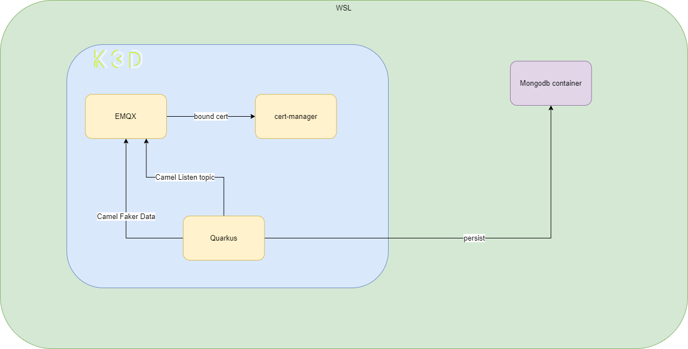

# kubernetes-with-quarkus Project

This project uses Quarkus, the Supersonic Subatomic Java Framework.

If you want to learn more about Quarkus, please visit its website: https://quarkus.io/ .

## Running the application in dev mode

You can run your application in dev mode that enables live coding using:
```shell script
./gradlew quarkusDev
```

> **_NOTE:_**  Quarkus now ships with a Dev UI, which is available in dev mode only at http://localhost:8080/q/dev/.

## Packaging and running the application

The application can be packaged using:
```shell script
./gradlew build
```
It produces the `quarkus-run.jar` file in the `build/quarkus-app/` directory.
Be aware that it’s not an _über-jar_ as the dependencies are copied into the `build/quarkus-app/lib/` directory.

The application is now runnable using `java -jar build/quarkus-app/quarkus-run.jar`.

If you want to build an _über-jar_, execute the following command:
```shell script
./gradlew build -Dquarkus.package.type=uber-jar
```

The application, packaged as an _über-jar_, is now runnable using `java -jar build/*-runner.jar`.

## Creating a native executable

You can create a native executable using: 
```shell script
./gradlew build -Dquarkus.package.type=native
```

Or, if you don't have GraalVM installed, you can run the native executable build in a container using: 
```shell script
./gradlew build -Dquarkus.package.type=native -Dquarkus.native.container-build=true
```

You can then execute your native executable with: `./build/kubernetes-with-quarkus-1.0.0-SNAPSHOT-runner`

If you want to learn more about building native executables, please consult https://quarkus.io/guides/gradle-tooling.

## Related Guides

- Camel Core ([guide](https://camel.apache.org/camel-quarkus/latest/reference/extensions/core.html)): Camel core functionality and basic Camel languages: Constant, ExchangeProperty, Header, Ref, Simple and Tokenize
- RESTEasy Reactive ([guide](https://quarkus.io/guides/resteasy-reactive)): A JAX-RS implementation utilizing build time processing and Vert.x. This extension is not compatible with the quarkus-resteasy extension, or any of the extensions that depend on it.
- Camel Direct ([guide](https://camel.apache.org/camel-quarkus/latest/reference/extensions/direct.html)): Call another endpoint from the same Camel Context synchronously
- Camel Paho MQTT5 ([guide](https://camel.apache.org/camel-quarkus/latest/reference/extensions/paho-mqtt5.html)): Communicate with MQTT message brokers using Eclipse Paho MQTT v5 Client
- SmallRye Health ([guide](https://quarkus.io/guides/microprofile-health)): Monitor service health
- Kubernetes ([guide](https://quarkus.io/guides/kubernetes)): Generate Kubernetes resources from annotations
- Micrometer metrics ([guide](https://quarkus.io/guides/micrometer)): Instrument the runtime and your application with dimensional metrics using Micrometer.
- Camel Log ([guide](https://camel.apache.org/camel-quarkus/latest/reference/extensions/log.html)): Log messages to the underlying logging mechanism
- Micrometer Registry Prometheus ([guide](https://quarkus.io/guides/micrometer)): Enable Prometheus support for Micrometer
- SmallRye OpenAPI ([guide](https://quarkus.io/guides/openapi-swaggerui)): Document your REST APIs with OpenAPI - comes with Swagger UI
- SmallRye Reactive Messaging - Kafka Connector ([guide](https://quarkus.io/guides/kafka-reactive-getting-started)): Connect to Kafka with Reactive Messaging

## Provided Code

### Reactive Messaging codestart

Use SmallRye Reactive Messaging

[Related Apache Kafka guide section...](https://quarkus.io/guides/kafka-reactive-getting-started)


### RESTEasy Reactive

Easily start your Reactive RESTful Web Services

[Related guide section...](https://quarkus.io/guides/getting-started-reactive#reactive-jax-rs-resources)

### SmallRye Health

Monitor your application's health using SmallRye Health

[Related guide section...](https://quarkus.io/guides/smallrye-health)

## Architecture




1. Quarkus 產生假資料至 EMQX
2. Quarkus 在 listen `cmd/state/+` topic 接收假資料
3. 再將其存入 mongodb 中

目的是透過 quarkus-kubernetes 讓 Quarkus 整合 Kubernetes。

1. 設定 Secret、ConfigMap
2. 設定 Ingress
3. 設定 Service
4. 設定 Deployment
5. 設定 ServiceAccount

Smally Health 自動會被整合至 Readiness、Liveness 選項；自動整合 Prometheus (此專案為實作)

## Build Native Image and Deploy

環境設定
```
quarkus.container-image.group=cch0124
quarkus.container-image.name=${quarkus.application.name:unset}
quarkus.container-image.tag=${quarkus.application.version:latest}
quarkus.container-image.registry=registry.hub.docker.com
quarkus.container-image.push=true
quarkus.container-image.build=true
quarkus.container-image.builder=jib
quarkus.container-image.labels=maintainer='cch'\\,app='kubernetes-with-quarkus'
quarkus.jib.base-native-image=quay.io/quarkus/quarkus-micro-image:2.0
quarkus.jib.native-arguments=-Djava.util.logging.manager=org.jboss.logmanager.LogManager
```

建置和推送 image，最後佈署至 kubernete。
```bash
gradle build -Dquarkus.package.type=native -Dquarkus.native.container-build=true -Dquarkus.kubernetes.deploy=true -Dquarkus.kubernetes.deployment-target=kubernetes -Dquarkus.container-image.push=true  -Dquarkus.container-image.build=true -Dquarkus.container-image.tag=$(git log -1 --pretty=format:%h)
```

`/kubernetes-with-quarkus/build` 在該目錄下會產生 Deployment yaml 等資源檔案。

```
quarkus.kubernetes.deploy=true # 表示要將其進行部署
quarkus.kubernetes.deployment-target=kubernetes
```

## K3d 
### Create Cluster
```bash 
k3d cluster create -c config.yaml --servers-memory 12G
$ k3d cluster list
NAME              SERVERS   AGENTS   LOADBALANCER
quarkus-cluster   1/1       2/2      true
$ k3d node list
NAME                           ROLE           CLUSTER           STATUS
k3d-quarkus-cluster-agent-0    agent          quarkus-cluster   running
k3d-quarkus-cluster-agent-1    agent          quarkus-cluster   running
k3d-quarkus-cluster-server-0   server         quarkus-cluster   running
k3d-quarkus-cluster-serverlb   loadbalancer   quarkus-cluster   running
$ cat /etc/hosts # add quarkus.cch.dev
# This file was automatically generated by WSL. To stop automatic generation of this file, add the following entry to /etc/wsl.conf:
# [network]
# generateHosts = false
127.0.0.1       localhost quarkus.cch.dev
```
### Install Helm

[install](https://helm.sh/docs/intro/install/)

### Create EMQX Broker

1. Install cert manager Operator

[install with helm](https://cert-manager.io/docs/installation/helm/)

```
$ helm repo add jetstack https://charts.jetstack.io
$ helm repo update
$ helm install cert-manager jetstack/cert-manager --namespace cert-manager  --create-namespace  --version v1.10.1 --set installCRDs=true
$ kubectl get pods -n cert-manager
NAME                                     READY   STATUS    RESTARTS   AGE
cert-manager-cainjector-f5897494-9vgxv   1/1     Running   0          70s
cert-manager-5c4c5d5c49-4trfz            1/1     Running   0          70s
cert-manager-webhook-56dbdf7576-67959    1/1     Running   0          70s
```

2. Install EMQX Operator
```
$ helm repo add emqx https://repos.emqx.io/charts 
$ helm repo update
$ helm install emqx-operator emqx/emqx-operator  --set installCRDs=true --namespace emqx-operator-system --create-namespace
```

3. Install

```bash
$ kubectl apply -f cert.yaml
$ kubectl apply -f deployment.yaml
```

## Test

```bash
$ kubectl  -n dev run mycurlpod --image=curlimages/curl -i --tty -- sh
$ kubectl  -n dev exec mycurlpod -- curl http://kubernetes-with-quarkus.dev.svc.cluster.local:8080/device?tachometer=3000
```

## Kubernetes 


delete
```
$ kubectl delete -f build/kubernetes/kubernetes.yml
```

### Defined secret and configMap

載入下面套件
```
io.quarkus:quarkus-kubernetes-config
```

在 `src/main` 下建立 kubernetes 目錄，並在下面定義 Secret 和 ConfigMap  資源。