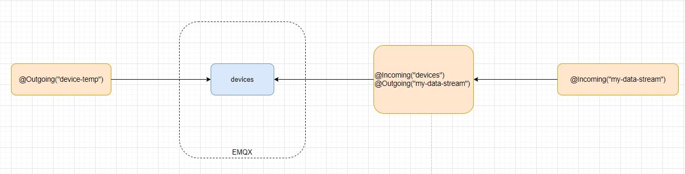
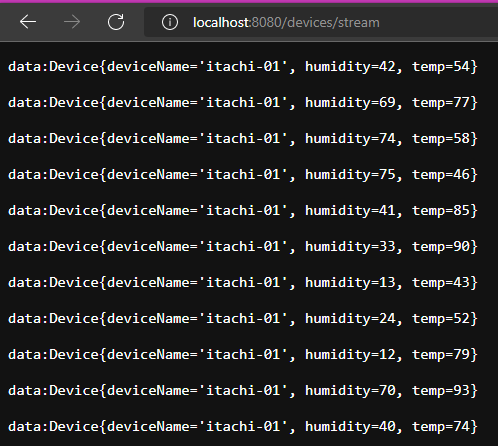

# mqtt-example Project

This project uses Quarkus, the Supersonic Subatomic Java Framework.

If you want to learn more about Quarkus, please visit its website: https://quarkus.io/ .

本範例使用 **SmallRye Reactive Messaging API**，用來實現訊息傳遞。主要基於三個元件
- **Message** 包覆資訊
- **Incoming** 一個註解，使得該方法消費一個流
```java
    @Incoming("devices")
    @Outgoing("my-data-stream")
    @Broadcast
    public Device process(byte[] data) {
        // ...
    }
```
- **Outgoing** 一個註解，使得該方法提供一個流，並可讓其它元件消費
```java

    @Outgoing("device-temp")
    public Multi<Device> generate() {
        // ...
    }
```


```
"device-temp"                          "devices"                        "my-data-stream"
--------------> MQTT topic (devices) <----------  @Incoming("devices") -----------------> @Outgoing("my-data-stream")
```

本範例在 `MqttDeviceMessageConsumer.java` 中使用 `@Incoming` 和 `@Outgoing` 做一些資料轉換。

```java
    @Incoming("devices")
    @Outgoing("my-data-stream")
    @Broadcast
    public Device process(byte[] data) {
        try {
            var device = new ObjectMapper().readValue(data, Device.class);
            LOG.info("Consumer Receiving readings: " + device.toString());
            return device;
        } catch (IOException e) {
            e.printStackTrace();
        }
        return null;
    }
```

在 API 部分會將其做一個綁定鏈如下:

```
 "devices"                                  "my-data-stream"
<---------- @Incoming("devices")         -------------------->
            @Outgoing("my-data-stream")
```




1. `TempGenerator.java` 負責產生數據，並向 MQTT devices topic 發送訊息
2. `MqttDeviceMessageConsumer.java` 接收 MQTT devices topic 資料並進行一些轉換
3. `DeviceResource.java` 檢索記憶體中的數據流，並使用服務器發送事件將這些裝置資料發送到瀏覽器

瀏覽器資料如下

