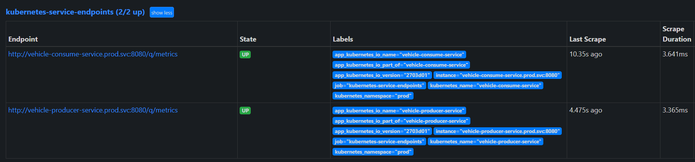

一個 kafka producer 和 consumer 的範例

## kube-prometheus-stack 監控 Quarkus 應用程式

元件有 grafana 與 promethues 和 Quarkus 應用程式

### 配置 scrape 至 Prometheus 配置檔

對於此安裝的 Helm 我們可以在該 values 中複寫 `prometheus.prometheusSpec.additionalScrapeConfigs` 

```yaml
prometheus:
  enabled: true
  service:
    port: 9090
    targetPort: 9090
    type: ClusterIP
  ingress:
    enabled: true
    ingressClassName: nginx
    hosts:
      - prometheus.cch.com
    paths:
      - /
  prometheusSpec:
    additionalScrapeConfigs: |
      - job_name: kubernetes-service-endpoints
        kubernetes_sd_configs:
        - role: service
        relabel_configs:

        # annotation 'prometheus.io/scrape' must be set to 'true'
        - action: keep
          regex: true
          source_labels: [__meta_kubernetes_service_annotation_prometheus_io_scrape]

        # service cannot be in kube-system or prom namespaces
        - action: drop
          regex: (kube-system|prom|observability)
          source_labels: [__meta_kubernetes_namespace]

        # service port name must end with word 'http'
        - action: keep
          regex: http
          source_labels: [__meta_kubernetes_service_port_name]

        # allow override of http scheme
        - action: replace
          regex: (https?)
          source_labels: [__meta_kubernetes_service_annotation_prometheus_io_scheme]
          target_label: __scheme__

        # allow override of default /metrics path
        - action: replace
          regex: (.+)
          source_labels: [__meta_kubernetes_service_annotation_prometheus_io_path]
          target_label: __metrics_path__

        # allow override of default port
        - action: replace
          regex: ([^:]+)(?::\d+)?;(\d+)
          replacement: $1:$2
          source_labels: [__address__, __meta_kubernetes_service_annotation_prometheus_io_port]
          target_label: __address__
        - {action: labelmap, regex: __meta_kubernetes_service_label_(.+)}
        - action: replace
          source_labels: [__meta_kubernetes_namespace]
          target_label: kubernetes_namespace
        - action: replace
          source_labels: [__meta_kubernetes_service_name]
          target_label: kubernetes_name
```

透過 `kubectl exec -it statefulset/$NAME -n $NS -c prometheus -- cat /etc/prometheus/config_out/prometheus.env.yaml` 可以驗證是否有配置，或是透過 Promethues 的前台。





##### 參考資料
- [prometheus-operator PrometheusSpec fields](https://github.com/prometheus-operator/prometheus-operator/blob/main/Documentation/api.md#prometheusspec)
- [promethues scrape_config](https://prometheus.io/docs/prometheus/latest/configuration/configuration/#scrape_config)


### 使用 ServiceMonitor

```yaml
apiVersion: monitoring.coreos.com/v1
kind: ServiceMonitor
metadata:
  name: quarkus-application
  namespace: prod
  labels:
    release: prom-stack # Mapping  Prometheus Operator Label
spec:
  endpoints:
  - port: http
    path: /q/metrics
    scheme: http
    interval: 5s
  namespaceSelector:
    matchNames:
    - prod
  selector:
    matchExpressions:
      - key: app.kubernetes.io/name
        values:
        - vehicle-producer-service
        - vehicle-consume-service
        operator: In
``` 

`spec.selector.matchExpressions` 選擇我們要監控的 Service。

官方提供的關聯圖，看了會比較好理解 


上面的 `ServiceMonitor.label` 在關聯圖來說會對應 prometheus 這個資源的 `serviceMonitorSelector` 設定
```bash
$ kubectl -n observability get prometheus prometheus-stack-kube-prom-prometheus  -o=jsonpath='{.spec.serviceMonitorSelector}'
{"matchLabels":{"release":"prometheus-stack"}}
```

```yaml
...
  serviceMonitorSelector:
    matchLabels:
      release: prometheus-stack
...
```

### 參考資料
- [prometheus-operator document](https://github.com/prometheus-operator/prometheus-operator/blob/main/Documentation/user-guides/getting-started.md)
