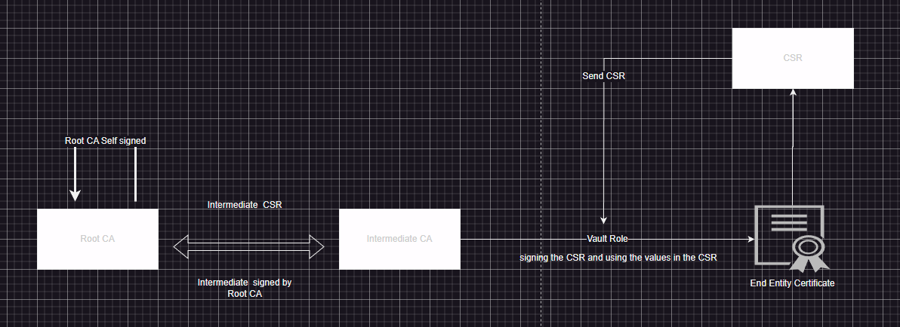
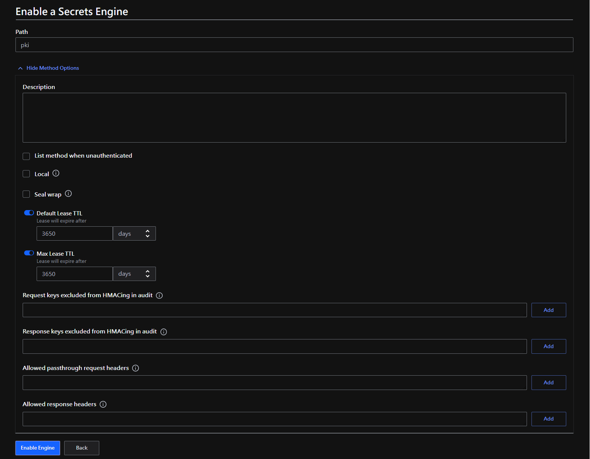
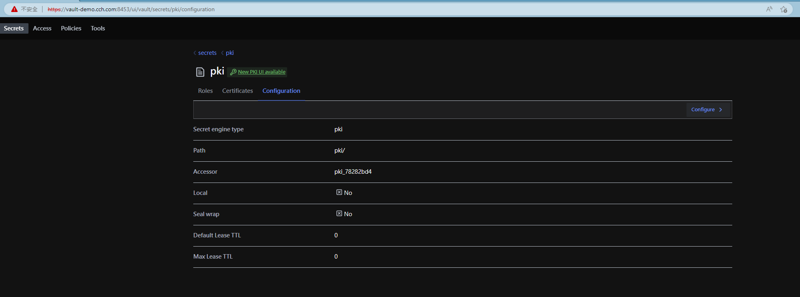
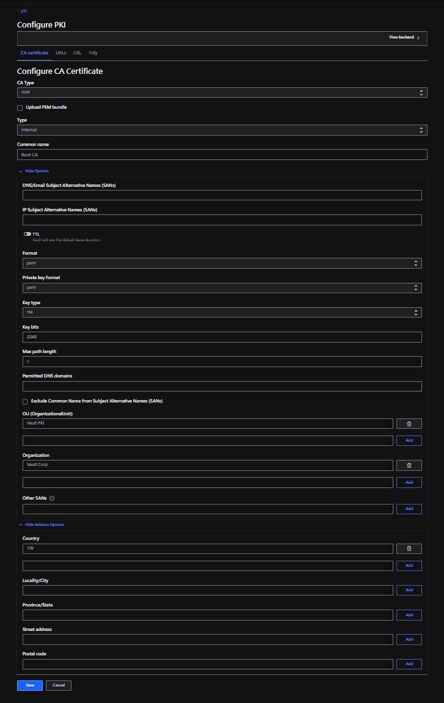
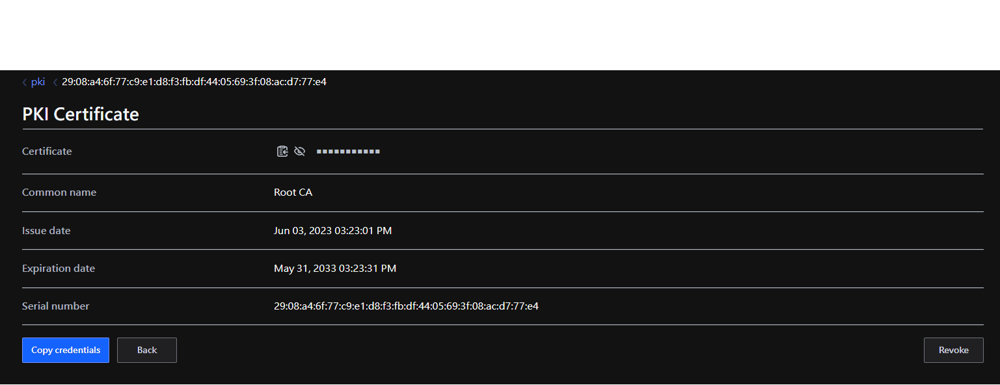
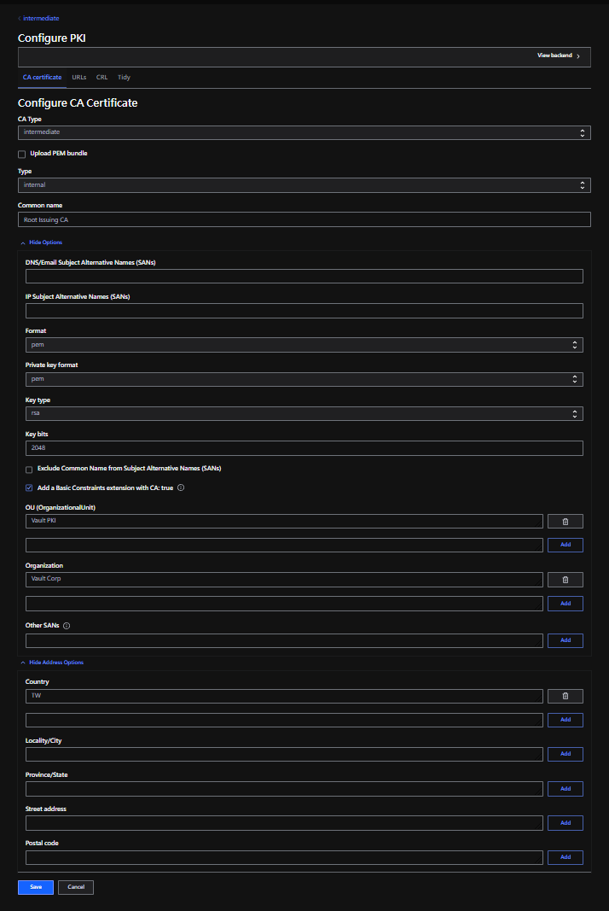
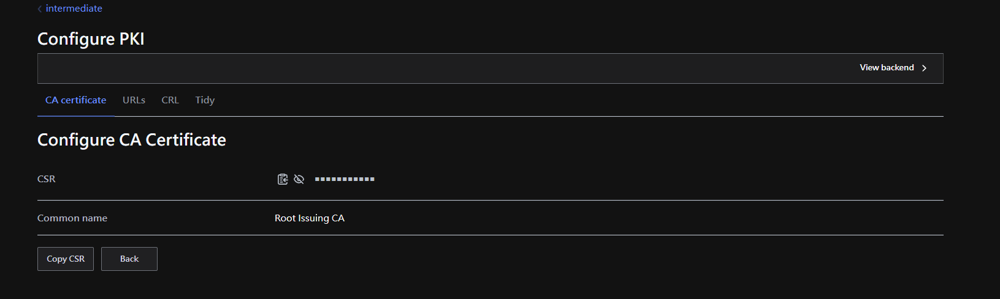
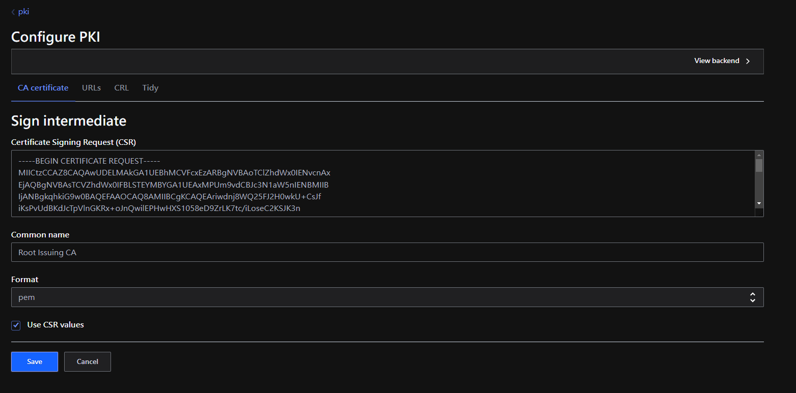
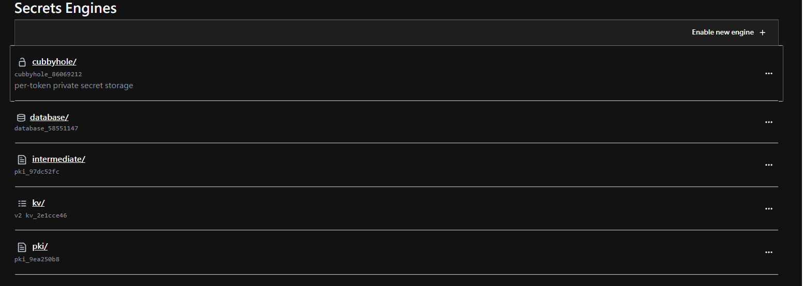
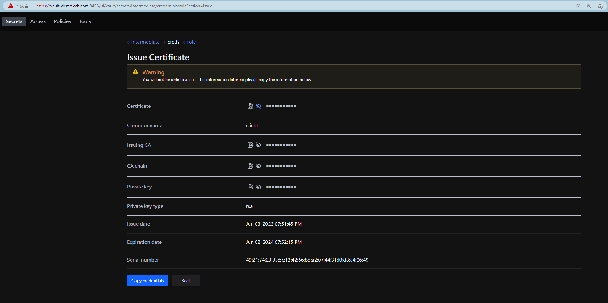

本次學習目標是理解證書(certificate)和PKI（public key infrastructure)。

這邊將會建立兩層的 PKI，分別是 Root CA 和 Intermediate CA，對於終端的用戶端我們將會透過 Vault 的角色進行簽發，同時也可以將頒發給用戶端的憑證稱為一個 `Entity`。Root CA 會以自簽方式簽發，對於它的 `Subject` 和 `Issuer` 都是自己；Intermediate CA 會由 Root CA 簽發，因此 `Issuer` 將會是 Root CA，`Subject` 將會使用 CN 進行一個額外資訊提供。

架構



使用指令方式參閱[這邊](command.md)

### 建立 Root CA
在 Vault 先啟用 PKI Engine 功能，接著在 Secrets Engines 可以看見 `pki` 的路徑。



>`TTL` 的設置將會讓我們申請的 Root CA 可以被使用的年限

如下圖點擊 `Configure`，進行後續配置



點擊後，選擇 `CA certificate` 再點擊 `configure CA`。

配置，`OU (OrganizationalUnit)`、`Organization`、`Country` 等



接著再 `pki` 路徑下可以看到所簽的 Root CA 資訊，像是過期時間(Expiration date)和唯一識別序號(Serial number)



接著透過 `Copy credentials` 可以拿到其憑證資訊。

```bash
```

>如果新增 CA 時 `Type` 選則 `exported` 私鑰將會在響應中返回；如果它是 `internal`，則不會返回私鑰，之後也無法被檢索。

再配置 Root CA 時把 `Max path length` 設置為 `1`，因為本範例有兩層的的 PKI，對於 Intermediate CA 會是 0，Root CA 為 1。下圖為一個示例三層 PKI，其包含兩層 Intermediate CA，對於最底層的不屬於 CA，而是用戶端憑證可以稱它為 `Entity`。

 http://www.pkiglobe.org/

如果將憑證使用 `openssl x509 -in root-ca.crt -text -noout` 解開可以看到以下資訊

```bash
...
 X509v3 extensions:
            X509v3 Key Usage: critical
                Certificate Sign, CRL Sign # 用於什麼目的
            X509v3 Basic Constraints: critical
                CA:TRUE, pathlen:1
...
```

## 建立中繼憑證
同樣起用 PKI Engine，但路徑可以換成 `intermediate`，然後設置 `TTL`。啟用後，同樣點擊 Configure，選擇 CA certificate 再點擊 `configure CA`。

並如下配置，CA Type 記得切換 `intermediate`



`Save` 後會有 `CSR` 資訊如下圖，這個 CSR 將會丟給 `Root CA`，需當下複製，否則切換頁面後將需要重新輸入。



但不知道為什麼無法配置 `Max path length`。

接著切回到一開始給 Root CA 用的 pki 路徑，點擊 `configuration` 在點擊 `configure` 最後再點擊 `Sign intermediate`。




接著再切換至 `intermediate` 路徑，同樣點擊 Configure，選擇 CA certificate 再點擊 `Set signed intermediate`，將剛剛從 `pki` 路徑產生的憑證丟到 `Signed Intermediate Certificate` 欄位中。

最後再 Secret Engine UI 上可以看到 `pki` 和 `intermediate` 兩個路徑



## 用戶端憑證

再 `intermediate` 路徑下建立一個 `role`，最後透過該 `role` 進行憑證簽發。點擊 `intermediate` 路徑選擇 `Roles` 再點選 `Create role`。
1. 輸入 Role name
2. 在 Hide Options 勾選 Allow any name；Max TTL 設定一年；Organizational Unit 輸入 Test Center；Organization 輸入 cch.com Corp
3. 在 Hide Address Option 中 Country 輸入 TW
4. 最後點擊 Create Role，完成建立 Role

> 這邊除了 Role name 不一定要填第 2、3 步驟的內容

透過 `Role` 簽發憑證。點擊建立的 `Role` 出現以下畫面輸入 `Common name` 點擊 `Generate` 即可生成用戶端憑證




簽發的內容解開
```bash
$ openssl x509 -in client.crt -text -noout
Certificate:
    Data:
        Version: 3 (0x2)
        Serial Number:
            49:21:74:23:93:5c:13:42:66:8d:a2:07:44:31:f0:d8:a4:06:49
        Signature Algorithm: sha256WithRSAEncryption
        Issuer: C = TW, O = Vault Corp, OU = Vault PKI, CN = Root Issuing CA # 由中繼憑證簽發
        Validity
            Not Before: Jun  3 11:51:45 2023 GMT
            Not After : Jun  2 11:52:15 2024 GMT # 一年期效
        Subject: C = TW, O = cch.com Corp, OU = Test Center, CN = client
        Subject Public Key Info:
            Public Key Algorithm: rsaEncryption
                Public-Key: (2048 bit)
                Modulus:
                    00:ec:9b:ee:80:50:0e:57:89:92:d2:19:6d:24:61:
                    16:77:e0:8d:ef:58:3d:a9:8e:f4:8e:32:eb:57:3d:
                    27:61:14:ff:3e:b2:30:05:c1:68:40:f7:5c:15:39:
                    24:cf:20:1f:4e:6d:50:42:d7:2c:04:77:a4:e1:bc:
                    2b:32:52:22:ef:6d:79:ea:00:4c:74:68:49:e9:45:
                    de:ab:7a:c7:97:b4:a8:e8:24:a9:d2:c2:df:45:f4:
                    c4:ea:59:2f:33:25:0e:aa:ed:22:32:9d:4e:88:6b:
                    2b:ec:ed:12:c5:47:af:0e:4f:d8:7e:5d:86:92:1c:
                    f2:26:f4:a6:9a:bb:db:01:cc:10:f2:ee:8e:e3:15:
                    15:f6:7d:0d:07:18:fe:a1:24:a5:6b:6b:e5:26:74:
                    c3:01:0f:a7:80:f5:85:0d:16:8d:6d:70:6c:1c:f6:
                    45:c9:bc:05:85:fb:6d:7c:3d:a3:2d:74:65:63:3a:
                    c3:31:35:44:2c:6b:d1:a2:15:44:8b:17:72:fa:d4:
                    2e:4f:27:23:ba:87:21:4a:a6:1d:8e:85:37:18:c3:
                    a1:5f:80:05:96:ed:4d:05:b5:4c:1b:c2:68:a4:40:
                    5e:86:71:0a:d3:1e:a8:3a:5c:53:95:f7:91:56:b6:
                    e8:46:0d:c2:6d:ef:0d:7f:3c:bd:3d:6e:88:08:78:
                    26:0d
                Exponent: 65537 (0x10001)
        X509v3 extensions:
            X509v3 Key Usage: critical
                Digital Signature, Key Encipherment, Key Agreement
            X509v3 Extended Key Usage: 
                TLS Web Server Authentication, TLS Web Client Authentication
            X509v3 Subject Key Identifier: 
                56:64:21:39:78:99:BE:D7:13:8B:45:D3:02:C6:6F:27:98:66:88:F7
            X509v3 Authority Key Identifier: 
                45:09:8E:CC:2E:24:ED:9D:1E:0D:AD:A2:8F:F0:F8:51:D1:EE:FF:CD
            X509v3 Subject Alternative Name: 
                DNS:client
    Signature Algorithm: sha256WithRSAEncryption
    Signature Value:
        1d:e2:82:3f:40:3d:25:fc:29:cb:a8:37:8a:90:8a:41:17:7f:
        bd:0c:8c:0d:b1:78:66:3b:92:15:40:f8:9a:7b:d3:27:bb:74:
        07:94:c0:4f:98:da:0d:27:e3:9b:fc:44:71:32:ba:87:c8:a3:
        e3:dc:33:d1:c7:fd:4b:b8:93:23:4e:09:b9:8b:d5:d9:37:d0:
        d9:0a:d4:13:80:1c:e0:06:6d:31:df:8c:87:90:fa:ca:f4:73:
        d5:5a:a1:c3:53:f8:ff:7c:2b:51:da:e4:cb:0d:10:f1:32:87:
        1a:dd:0b:1b:ab:90:f4:1d:b6:5a:d3:77:dd:f4:b8:13:2e:d9:
        46:a0:17:e9:5b:03:88:0b:03:de:cd:0e:eb:a4:0b:d2:7e:82:
        08:23:fb:79:d6:5f:d1:4b:9b:33:63:d2:29:86:97:82:d6:24:
        d8:df:26:01:16:6a:d1:e1:5e:c8:d0:1f:b7:1c:2c:c0:76:43:
        15:21:30:9f:b9:b6:5e:f1:2e:b7:01:72:5d:49:8b:8d:48:a3:
        99:e1:30:5c:2a:fb:ec:ed:2e:fc:8f:c6:22:04:0f:8c:ca:61:
        4a:e4:60:ad:8b:13:2a:a1:cf:79:84:56:08:be:69:f4:db:e4:
        7e:ad:11:8e:c7:f0:1d:29:f5:27:62:67:60:b3:88:be:e4:0a:
        a3:ab:dd:24
```


驗證

```bash
$ openssl verify -verbose -CAfile <(cat intermediate-ca.crt root-ca.crt) client.crt 
client.crt: OK
```

如果要進階在驗證可以在 enable pki engine 並讓它在變成 Root CA 的另一個中繼憑證，在建立 `Role` 簽發一個用戶端憑證來相互驗證，原則中繼憑證是不會驗過由另一個中繼憑證所簽發的用戶端憑證。

```bash
$ openssl verify -verbose -CAfile <(cat intermediate-ca.crt root-ca.crt) other.crt 
C = Japan, O = Konohagakure, OU = Naruto, CN = madara
error 20 at 0 depth lookup: unable to get local issuer certificate
error other.crt: verification failed
```


```bash
$ openssl x509 -in other.crt -text -noout
Certificate:
    Data:
        Version: 3 (0x2)
        Serial Number:
            62:98:0f:de:b9:60:4c:38:2a:90:d4:e9:38:cb:57:46:1b:b5:c8:69
        Signature Algorithm: sha256WithRSAEncryption
        Issuer: C = Japan, O = Konohagakure, OU = Naruto, CN = naruto # Issuer 是不同
        Validity
            Not Before: Jun  3 12:24:21 2023 GMT
            Not After : Jun  6 12:24:51 2023 GMT
        Subject: C = Japan, O = Konohagakure, OU = Naruto, CN = madara
```

## 驗證

```bash
$ openssl verify -verbose -CAfile <(cat naruto_intermediate.cert.pem root-ca.crt) client.crt 
client.crt: OK
```