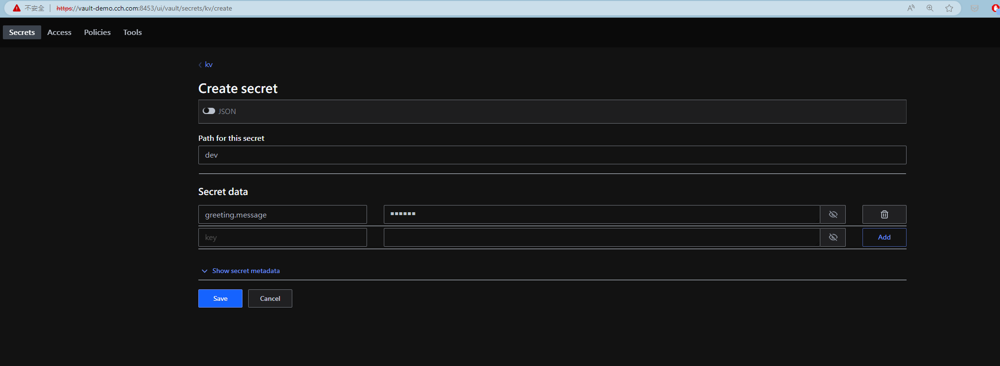

策略(policy)定義一個或多個路徑和允許的權限列表。大多這些權限都映射到 Vault API 支持的 HTTP 動詞。

|Capability	|Associated HTTP verbs|
|---|---|
|create	|POST/PUT|
|read	|GET|
|update	|POST/PUT|
|delete	|DELETE|
|list	|LIST|
|patch	|PATCH|
|sudo	|-|
|deny	|-|

`deny` 權限禁止訪問路徑。當與其他功能結合使用時，它優先最高。

Vault 中的內容都是基於路徑，策略的設計也是。它能夠授予權限來限制可存取的路徑。在人或服務獲得存取權限之前，管理員必須使用身份驗證方法配置 Vault。身份驗證是針對內部或外部系統驗證人或服務的訊息的過程。

身份驗證方法包含以下
- Tokens
- User/pass
- kubernetes
- etc.


## Create Policy

使用 kubectl port-forward 進行操作

假設已經在 Vault 的 [k/v 版本二](https://developer.hashicorp.com/vault/tutorials/policies/write-a-policy-using-api-docs)中設定如下圖的 secret 物件。



下面範例是一個 quarkus 讀取的權限設定

```bash
vim secret-dev-policy.hcl
path "kv/data/dev" {  capabilities = ["read", "list"] }
```

```bash
$ export VAULT_ADDR=http://127.0.0.1:8888
$ vault login
$ vault policy write quarku-kv-policy policy.hcl 
Success! Uploaded policy: quarku-kv-policy
```

```bash
$ vault token create -format=json -policy="quarku-kv-policy"
{
  "request_id": "f1f04d47-ba6f-ee2c-7e46-b3970cf2de98",
  "lease_id": "",
  "lease_duration": 0,
  "renewable": false,
  "data": null,
  "warnings": null,
  "auth": {
    "client_token": "hvs.CAESIEkvqm4cfuml8FoxZsru-KrgOokG-ucct4ZO93F4ZudhGh4KHGh2cy56R3F2U3FJOWJsWHhzN0R6RW1SV2JjQ0c",
    "accessor": "0P1xGmKlIBWkKYU6kW9j8hQJ",
    "policies": [
      "default",
      "quarku-kv-policy"
    ],
    "token_policies": [
      "default",
      "quarku-kv-policy"
    ],
    "identity_policies": null,
    "metadata": null,
    "orphan": false,
    "entity_id": "",
    "lease_duration": 2764800,
    "renewable": true,
    "mfa_requirement": null
  }
}
```